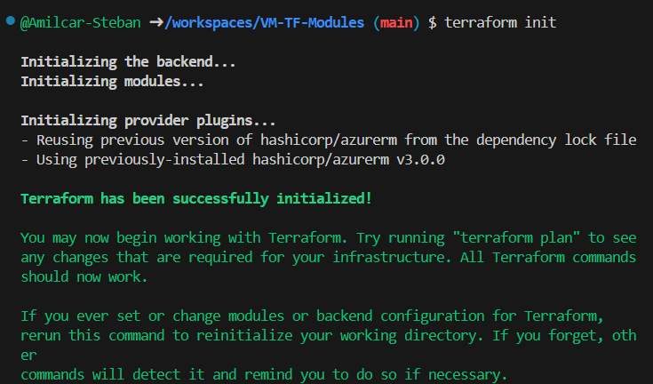
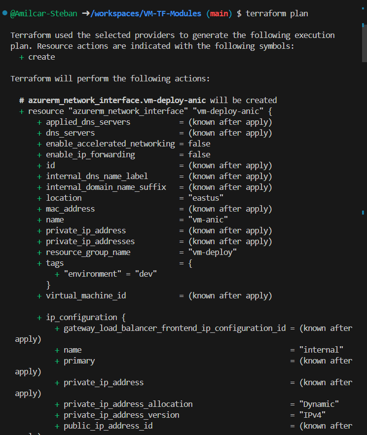
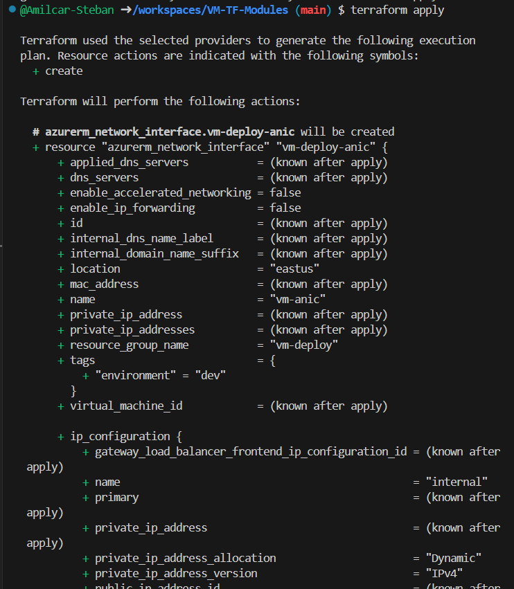
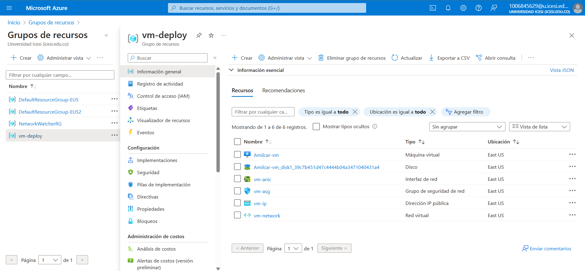
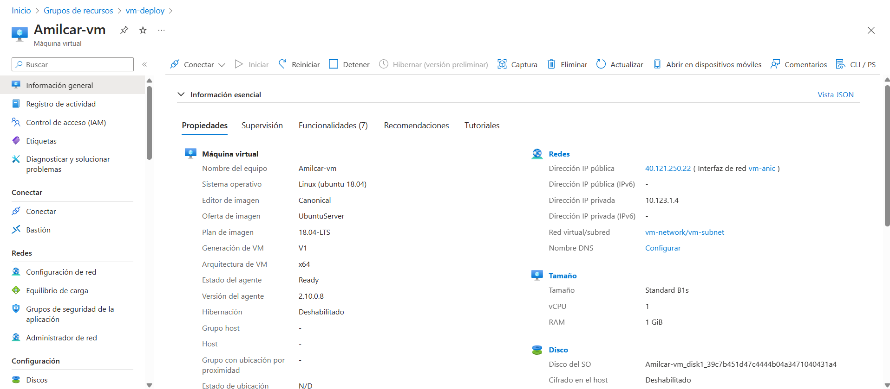
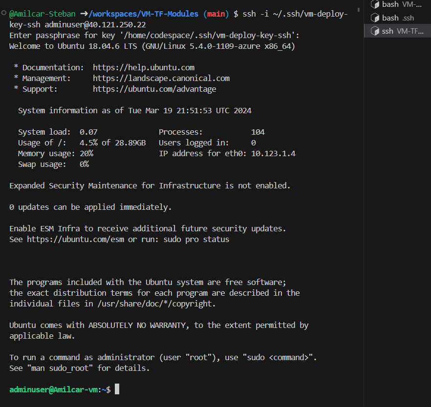

# 
<strong>VIRTUAL MACHINE TERRAFORM</strong>

## Autors
*   Amilcar Rodriguez - A00369769

## Description

This project aims to create a virtual machine in azure using terraform, for this we will create different modules or configurations for the virtual machine to work correctly. 

## Step 1
Create main.tf, this file contain different components that are necesary to create the group and modules, for example:
* Virtual Network
* subnet
* public ip
* network interface
* security group
* IR-GS association
* Virtual machine

### Virtual Network:

    resource "azurerm_virtual_network" "vm-deploy-avn" {
    name                = "${var.prefix}-network"
    location            = azurerm_resource_group.vm-deploy-arg.location
    resource_group_name = azurerm_resource_group.vm-deploy-arg.name
    address_space       = ["10.123.0.0/16"]
    tags = {
        environment = "dev"
        }
    }
### Subnet
    resource "azurerm_subnet" "vm-deploy-subnet" {
    name                 = "${var.prefix}-subnet"
    resource_group_name  = azurerm_resource_group.vm-deploy-arg.name
    virtual_network_name = azurerm_virtual_network.vm-deploy-avn.name
    address_prefixes     = ["10.123.1.0/24"]
    }
### Network security group
    resource "azurerm_network_security_group" "vm-deploy-asg" {
    name                = "${var.prefix}-asg"
    location            = azurerm_resource_group.vm-deploy-arg.location
    resource_group_name = azurerm_resource_group.vm-deploy-arg.name

    tags = {
        environment = "dev"
        }
    }
### Rules of network security 
    resource "azurerm_network_security_rule" "vm-deploy-rule" {
    name                        = "${var.prefix}-rule"
    priority                    = 100
    direction                   = "Inbound"
    access                      = "Allow"
    protocol                    = "*"
    source_port_range           = "*"
    destination_port_range      = "*"
    source_address_prefix       = "*"
    destination_address_prefix  = "*"
    resource_group_name         = azurerm_resource_group.vm-deploy-arg.name
    network_security_group_name = azurerm_network_security_group.vm-deploy-asg.name
    }
### Subnet network security group
    resource "azurerm_subnet_network_security_group_association" "vm-deploy-asga" {
    subnet_id                 = azurerm_subnet.vm-deploy-subnet.id
    network_security_group_id = azurerm_network_security_group.vm-deploy-asg.id
    }
### ip public
    resource "azurerm_public_ip" "vm-deploy-ip" {
    name                = "${var.prefix}-ip"
    resource_group_name = azurerm_resource_group.vm-deploy-arg.name
    location            = azurerm_resource_group.vm-deploy-arg.location
    allocation_method   = "Dynamic"

    tags = {
        environment = "dev"
        }
    }
### Network interface
    resource "azurerm_network_interface" "vm-deploy-anic" {
    name                = "${var.prefix}-anic"
    location            = azurerm_resource_group.vm-deploy-arg.location
    resource_group_name = azurerm_resource_group.vm-deploy-arg.name

    ip_configuration {
        name                          = "internal"
        subnet_id                     = azurerm_subnet.vm-deploy-subnet.id
        private_ip_address_allocation = "Dynamic"
        public_ip_address_id          = azurerm_public_ip.vm-deploy-ip.id
    }

    tags = {
        environment = "dev"
        }
    }
### Configuration virtual machine with ssh config

    module "vm-deploy-vm" {
    source                = "./modules/virtual-machine"
    vmname                = var.vmname
    location              = azurerm_resource_group.vm-deploy-arg.location
    resource_group_name   = azurerm_resource_group.vm-deploy-arg.name
    network_interface_ids = [azurerm_network_interface.vm-deploy-anic.id]
    vm_size               = var.vm_size
    os_disk_type          = var.os_disk_type
    admin_usename         = var.admin_usename
    image_publisher       = var.image_publisher
    image_offer           = var.image_offer
    image_sku             = var.image_sku
    }

In the main we declared diferents varables, and this variables should be in a different file. We will create a file "variables.tf" and write the variables. So:

    variable "prefix" {
    type        = string
    description = "Prefix for resource names"
    }
    variable "name_function" {
    type        = string
    description = "Name of the function"
    }
    variable "location" {
    type        = string
    description = "Location for the Azure resources"
    }
    variable "os_disk_type" {
        type = string
        description = "type of the os disk. example Standard_LRS"
    }
    variable "admin_usename" {
        type = string
        description = "local admin user of the virtual machine"
    }

    variable "resource_group_name" {
        type = string
        description = "resource group name of the virtual network"
    }

    variable "image_publisher" {
        type = string
        description = "Azure image publisher"
        default = "Canonical"
    }
    variable "image_offer" {
        type = string
        description = "Azure image offer"
        default = "UbuntuServer"
    }
    variable "image_sku" {
        type = string
        description = "Azure image sku"
        default = "18.04-LTS"
    }

    variable "vmname" {
        type = string
        description = "name of the vm"
    }
    variable "vm_size" {
        type = string
        description = "size of the virtual machine"
    }

And to put explicit values in the variables, we will create other file "terraform.tfvars" and modify as we wish

    name_function = "vm-deploy"
    location      = "East US"
    prefix        = "vm"
    resource_group_name = "vm-deploy"
    vmname = "Amilcar-vm"
    vm_size = "Standard_B1s"
    os_disk_type = "Standard_LRS"
    admin_usename = "********"

Also, we will create a file "providers.tf" and we specific the provider that is azurerm, so:

    provider "azurerm" {
    features {}
    }

Also, create a folder "modules" where we will create the module of virtual machine, so, we create file "main.tf" and we spicify the configurations of VM:

    # main.tf file of virtual-machine module
    resource "azurerm_linux_virtual_machine" "vm" {
        name                  = var.vmname
        resource_group_name   = var.resource_group_name
        location              = var.location
        size                  = var.vm_size
        admin_username        = var.admin_usename
        network_interface_ids = var.network_interface_ids
        
        admin_ssh_key {
        username   = var.admin_usename
        public_key = file("~/.ssh/vm-deploy-key-ssh.pub")
        }

        os_disk {
            caching                 = "ReadWrite"
            storage_account_type    = var.os_disk_type
        }
        source_image_reference {
            publisher = var.image_publisher
            offer     = var.image_offer
            sku       = var.image_sku
            version   = "latest"
        }
        tags = {
        environment = "dev"
        }
    }

in the pre file "main.tf" we specify differents variables, now, we will create this variables in a file "variables.tf": 

    # variables.tf file of virtual-machine module
    variable "vmname" {
        type = string
        description = "The name of the virtual machine"
    }
    variable "resource_group_name" {
        type = string
        description = "The name of resource group"
    }
    variable "location" {
        type = string
        description = "Azure location "
    }
    variable "network_interface_ids" {
        type = list(string)
        description = "network interface id"
    }
    variable "vm_size" {
        type = string
        description = "size of the virtual machine"
    }
    variable "os_disk_type" {
        type = string
        description = "type of the os disk. example Standard_LRS"
    }
    variable "admin_usename" {
        type = string
        description = "local admin user of the virtual machine"
    }
    variable "image_publisher" {
        type = string
        description = "Azure image publisher"
    }
    variable "image_offer" {
        type = string
        description = "Azure image offer"
    }
    variable "image_sku" {
        type = string
        description = "Azure image sku"
    }

in this moment, we ready to up terraform vm in azure.

## Step 2

Now, we will use this commands to up terraform main:

Login in azure:

    az login 
Init Terraform:

    terraform init

  

  

  

  

  

  
</p
